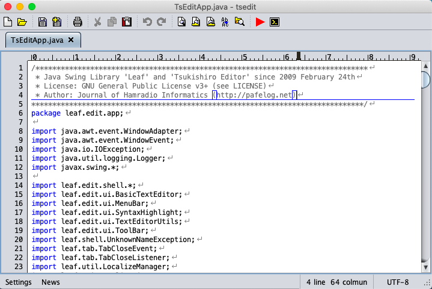

Leaf/Tsukishiro Editor 2.1
====


Leaf is an awesome text editor component library and Tsukishiro Editor is a sample rich text editor.



## Documents

- [Javadoc](https://nextzlog.github.io/leaf/doc/index.html)

## Build

[Gradle](https://gradle.org/) retrieves dependent libraries, runs tests, and generates a JAR file automatically.

```shell
$ gradle build javadoc publish
```

## Maven

If you want to use the latest build, configure the `build.gradle` as follows:

```Groovy:build.gradle
repositories.maven {
  url('https://nextzlog.github.io/leaf/mvn/')
}

dependencies {
  implementation('leaf:leaf:+')
}
```

## Contribution

Feel free to contact [@nextzlog](https://twitter.com/nextzlog) on Twitter.

## License

### Author

[無線部開発班](https://pafelog.net)

### Clauses

- This library is free software: you can redistribute it and/or modify it under the terms of the GNU Lesser General Public License as published by the Free Software Foundation, either version 3 of the License, or (at your option) any later version.

- This library is distributed in the hope that it will be useful, but **without any warranty**; without even the implied warranty of **merchantability or fitness for a particular purpose**.
See the GNU Lesser General Public License for more details.

- You should have received a copy of the GNU Lesser General Public License along with this library.
If not, see <http://www.gnu.org/licenses/>.
